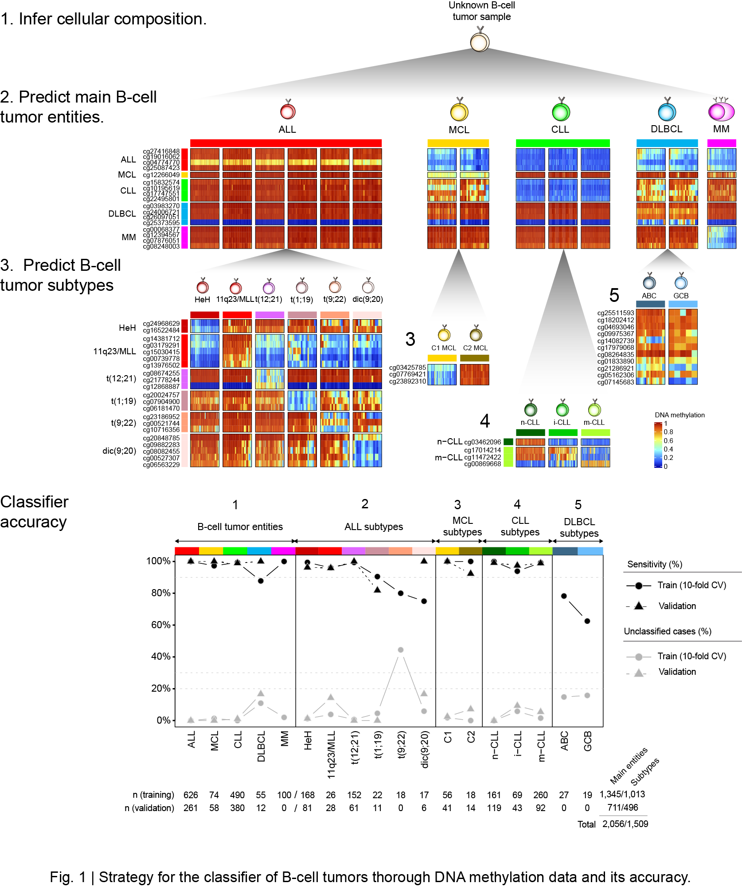

```{r setup, include=FALSE}
knitr::opts_chunk$set(echo = TRUE)
```

# Introduction
B-cell tumors comprise a variety of neoplasias derived from normal B cells of the heamopoietic system. Collectively, ALL, MCL, CLL, DLBCL and MM represent the majority of diagnosed B-cell neoplasias. They are further classified in subtypes with different clinicobiological features. The code we provide here represents a Pan B-cell tumor classifier algorithm, which contains two steps: in the firt step, an unknown sample is classified into one of the five major B-cell tumor entities previously mentioned; in the second step, these major entities are further classified into their subtypes: ALL subtypes, HeH; 11q23/MLL; t(12;21); t(1;19); t(9;22); dic(9;20). MCL subtypes, C1/cMCL and C2/nnMCL. CLL subtypes, n-CLL/low programmed CLL, i-CLL/intermediate programmed CLL and m-CLL/high programmed CLL and DLBCL subtypes, ABC and GCB. Although an unbiased prediction can serve as an internal control, if trusty knowledge of the entity is avaialble, we recommend to specify it to the classifier algorithm. Please, note that the CpGs of the classifier are present in both Illumina 450k and EPIC arrays, and thus both platforms are supported. A first step to predict B-cell tumor content in the samples is available (strongly recommended), as the predictor assumes a minimum of 60% tumor cell content. Please, note that the tumor cell content prediction based on DNA methylation may not be accurate for some DLBCL and for MM cases, as we reported in [Duran-Ferrer 2020](https://www.nature.com/articles/s43018-020-00131-2). The strategy and accuracy of the classifier can be seen in the following figure:




# Load required data.

## Load R packages.

```{r}

## Load packages and set general options
options(stringsAsFactors = F,error=NULL)
##needed packages
library(e1071)
library(xlsx)
library(data.table)

```

## Download and load required data into R.

```{r}

download.file("https://github.com/Duran-FerrerM/Pan-B-cell-methylome/raw/master/data/B.cell.tumor.classifier.RData", destfile = "B.cell.tumor.classifier.RData", method="libcurl")
load("B.cell.tumor.classifier.RData")

```

# Analyses

## `Deconvolute.Bcell.tumor` function.
The methodology to predict B-cell tumors is simply using the function `Deconvolute.Bcell.tumor`, which has the following arguments:

  * `data`: data.frame or matrix with the methylation beta values and named rows(CpGs) and columns(Samples)
  * `predict.tumor.cell.content`: logical indicating whether predict B-cell tumor content based on DNA methylation values.
  * `microenvironment.CpGs`: Type of microenvironmental cells used for deconvolution. Bcells.2CpGs only allow the prediction of B-cell proportion.
  * `predict.Bcell.tumors`: logical indicating whether predict B-cell tumor entities and subtypes.
  * `which.predictor`: character string that specifies if the full prediction (entity+subtype) or which one of the five predictors will be applied. Possible values are "entity.subtype","entity","ALL","CLL","DLBCL" or "MCL". Defaults to "entity.subtype" (full prediction).
  * `impute.missings`: impute missing beta values? Default to FALSE. Use with caution, the effect of missings to the predictions has not been extensively tested.
  * `export`: export results to a .xlsx file? The file will be named "methy.classifier.results.xlsx" and stored in the working directory.

**NOTE:**. In the case of leukemia or lymphoma samples, it is expected that normal B/T lymphocytes are poorly infiltrated in the sample, and thus the B/T-cell signature present in the data can be understood as a surrogate of tumor cell content. This strategy yielded proved correct for high number of samples as we reported in [Duran-Ferrer M 2020](https://www.nature.com/articles/s43018-020-00131-2) for MCL and CLL patients. This may be not the case for other tumors.

The output consits of one table with the cellular compositions of B-cell tumor samples depending on the assumed microenvironmental cells, and the others the estimated probabilities of B-cell tumor entities and subtypes, and a final table with the predicted entity/subtype for each sample. The output includes a raw svm prediction and a suggested prediction that takes into account confusion among entities/subtypes. If only one predictor is applied (see arguments) the ouptut only includes a table with the predictions of that specific predictor.

## Example data.

```{r}

Results <- Deconvolute.Bcell.tumor(data=example.betas,
                        predict.tumor.cell.content = T,
                        microenvironment.CpGs = "Pan.Bcell.microenvironment",
                        predict.Bcell.tumors = T,
                        which.predictor="entity.subtype",
                        impute.missings = T,
                        export=F
                        )


Results <- cbind(Results$Cellular.proportions,
                 Results$combined.prediction)

DT::datatable(Results, options = list(scrollX = T, scrollY=T), rownames = F)


##export
fwrite(Results,"B.cell.tumors.composition.tsv",sep="\t")

```

## Get all code at once
```{r ref.label=knitr::all_labels(), echo=TRUE, eval=FALSE}
```


# Session Information

```{r}

sessionInfo()

```