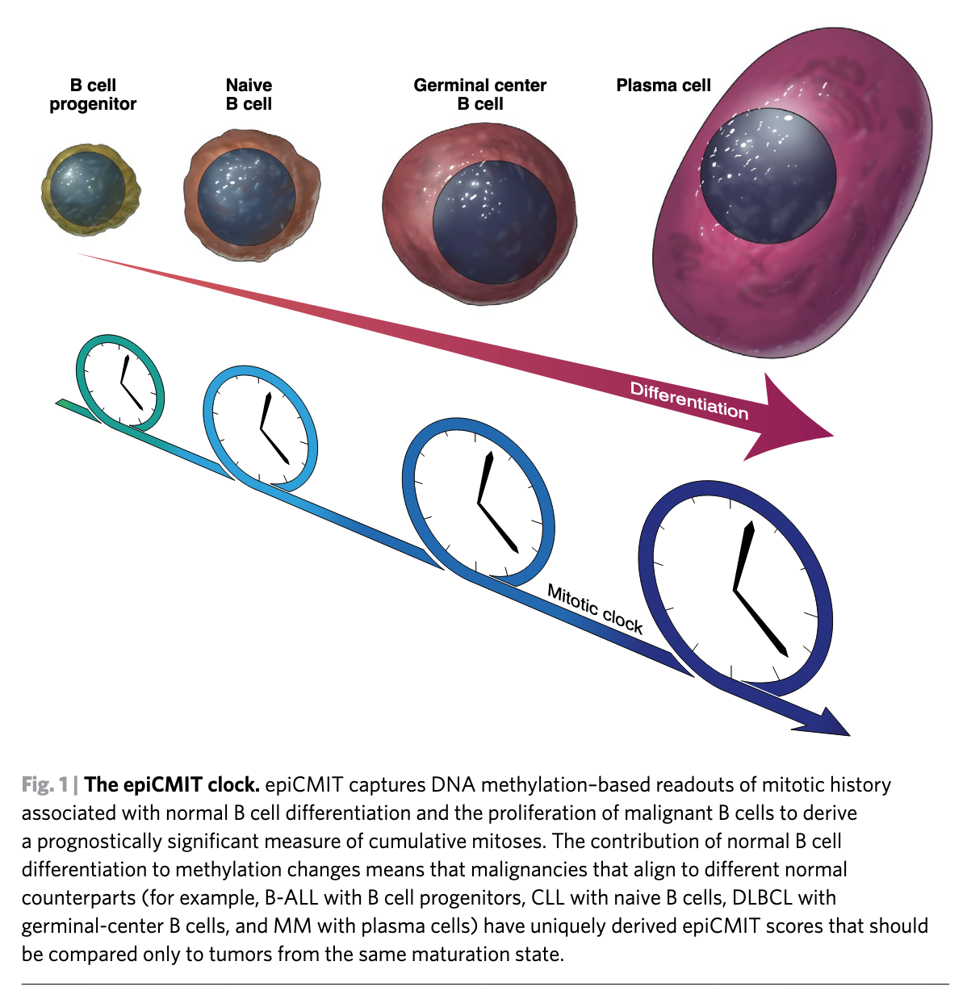

```{r setup, include=FALSE}
knitr::opts_chunk$set(echo = TRUE)
```

# Introduction
The epiCMIT (epigenetically-determined Cumulative MIToses) mitotic clock represents a relative measure of the total proliferative history of normal and neoplastic B cells. It is built considering the highest score from their two underlying hyper- and hypomethylation-based mitotic clocks, called epiCMIT-hyper and the epiCMIT-hypo, respectively. The code I provide here calculates the three mitotic clocks for each sample. All of them range from 0 to 1, depending on low or high relative proliferative history. Based on the data analyzed in the manuscript, considering hyper- or hypomethylation separately may not be sufficient to capture the entire mitotic history of cancer cells. A comprehensive selection of CpGs was performed to build the epiCMIT. Nonetheless, given the careful CpG filtering it is likely that epiCMIT represent a pan-cancer mitotic clock. Please note that the proliferative history of B-cell tumors include the proliferative history of normal B-cell development and the proliferative history of malignant transformation and progression. The epiCMIT should be compared then among B-cell tumors with the same cellular origin! The current code supports several DNA methylation approaches, including 450k and EPIC Illumina arrays, and the next generation sequencing (NGS) approaches single (S) and paired end (PE) RRBS, ERRBS and WGBS. The original epiCMIT implementation for Illumina arrays was developed in [Duran-Ferrer M 2020](https://www.nature.com/articles/s43018-020-00131-2), whereas the strategy for NGS-based approaches was developed in  the CLL1100 study (*Knisbacher, Lin, Hahn, Nadeu, Duran-Ferrer et al, Nat. Genet. 2022, accepted*).



The epiCMIT mitotic clock, from Strati, P., Green, M.R. A, Nat Cancer, 2020.

# Load required data.

## Load R packages.
Please, make sure you have at least version 1.44.0 of the *GenomicRanges* package to run the following lines of code. A complete list of packages and versions used to compile this vignette is available at the end.

```{r}

## Load packages and set general options
options(stringsAsFactors = F,error=NULL)
##needed packages
library(GenomicRanges)
library(data.table)

```

## Download and load required data into R.

We will download the data from github. Make sure you have internet connection.

```{r}

download.file("https://github.com/Duran-FerrerM/Pan-B-cell-methylome/raw/master/data/Estimate.epiCMIT.RData", destfile = "Estimate.epiCMIT.RData", method="libcurl")
load("Estimate.epiCMIT.RData")

## Take a look at RRBS data. Please, note that your data can be a matrix, data.frame or GRange object.
print(RRBS.SE.hg19.Examples$CW101)

```

# Analyses

The methodology to estimate the epiCMIT is the following:

1. Map your DNA methylation matrix to epiCMIT-CpGs and the correct genome assembly using the function `DNAm.to.epiCMIT`. This function converts a DNA methylation matrix (DNAm) into a suitable GRange object to calculate the epiCMIT and contains the following arguments:
  * `DNAm`: DNA methylation matrix. Should be a matrix, data.frame or GRanges object.
  * `DNAm.genome.assembly`: The genome assembly of the DNAm matrix. Supported versions are "hg19" and "hg38".
  * `map.DNAm.to`: Map the data to Illumina-450k epiCMIT-CpGs or WGBS epiCMIT-CpGs. Should be "Illumina.450K.epiCMIT" or "WGBS.epiCMIT".
  * `min.epiCMIT.CpGs`: Integer, default 800 CpGs. Recommended a minimum of 800 epiCMIT-CpGs, less CpGs have not been thoroughly tested.
  *`CpGs.as.DNAm.rownames`: logical, default TRUE. Are rownames of your matrix CpG names? If so they will be used for mapping. If FALSE, coordinates should be provided. If `DNAm` is of class matrix and `CpGs.as.DNAm.rownames=FALSE`, CpG coordinates and DNAm info columns from DNAm should be provided in the following arguments:`DNAm.chr`, `DNAm.start`, `DNAm.end`, `DNAm.meth`
  
2. Calculate the epiCMIT  after running `DNAm.to.epiCMIT` with the `epiCMIT`function, which contains the following arguments:
  * `DNAm.epiCMIT`:The GRange object after running `DNAm.to.epiCMIT` function.
  * `return.epiCMIT.annot`: logical indicating whether to export the epiCMIT-CpGs used and metadata info.
  * `export.results`: logical, indicating whether to export the results.
  * `export.results.dir`: character indicating the path to export the results.
  *`export.results.name`: character string with the name for the exported file.

## 450k/EPIC Illumina array data.

The [original epiCMIT](https://www.nature.com/articles/s43018-020-00131-2) estimation is calculated from 450k and EPIC DNA methylation data.

```{r}

##
## Calculate epiCMIT in example Illumina 450K data from Duran-Ferrer 2020, Nature Cancer
## 

head(Illumina.450k.hg19.example)
DNAm.epiCMIT <- DNAm.to.epiCMIT(DNAm = Illumina.450k.hg19.example,
                         DNAm.genome.assembly = "hg19",
                         map.DNAm.to = "Illumina.450K.epiCMIT",
                         min.epiCMIT.CpGs = 800 # minimum recommended
                         )
DNAm.epiCMIT

##calculate epiCMIT
epiCMIT.Illumina <- epiCMIT(DNAm.epiCMIT = DNAm.epiCMIT,
                             return.epiCMIT.annot = FALSE,
                             export.results = TRUE,
                             export.results.dir = ".",
                             export.results.name = "Illumina.450k.example_"
                             )
head(epiCMIT.Illumina$epiCMIT.scores)
epiCMIT.Illumina.results <- cbind(epiCMIT.Illumina$epiCMIT.scores,
                                  epiCMIT.CpGs=epiCMIT.Illumina$epiCMIT.run.info$epiCMIT.CpGs,
                                  epiCMIT.hyper.CpGs=epiCMIT.Illumina$epiCMIT.run.info$epiCMIT.hyper.CpGs,
                                  epiCMIT.hypo.CpGs=epiCMIT.Illumina$epiCMIT.run.info$epiCMIT.hypo.CpGs
                                  )

DT::datatable(epiCMIT.Illumina.results, options = list(scrollX = T, scrollY=T), rownames = F)

##export
fwrite(epiCMIT.Illumina.results,"epiCMIT.Illumina.arrays.scores.tsv",sep="\t")

```


## RRBS/NGS data.

For NGS-based DNA methylaion data, a new strategy was developed in *Knisbacher, Lin, Hahn, Nadeu, Duran-Ferrer et al. Molecular map of chronic lymphocytic leukemia and its impact on outcome, Nat. Genet, 2022, accepted*. (new tutorial comming soon!)

We can create a loop with the R function `lapply` and run both functions at the same time for all the samples to subsequently store all the results into a list. To do so, we can execute the following lines of code:

```{r}

##
## Example with RRBS-SE hg19 data
##

epiCMIT.RRBS <- suppressWarnings( ## supress warning so that all warning do not appear in the html document.
  suppressMessages(
    lapply(names(RRBS.SE.hg19.Examples),function(sample.i){
  
  ##transform data to run epiCMIT() function.
  DNAm.epiCMIT <- DNAm.to.epiCMIT(DNAm = RRBS.SE.hg19.Examples[[sample.i]],
                                  DNAm.genome.assembly = "hg19",
                                  map.DNAm.to = "WGBS.epiCMIT",
                                  min.epiCMIT.CpGs = 800 # minimum recommended
  )
  
  ##calculate epiCMIT
  epiCMIT.results <- epiCMIT(DNAm.epiCMIT = DNAm.epiCMIT,
                             return.epiCMIT.annot = TRUE,
                             export.results = FALSE, ## change to TRUE to export results for every single sample
                             export.results.dir = ".",
                             export.results.name = paste0("RRBS-SE.",sample.i,"_example_")
  )
})
)
)


```

We now can gather all the relevant results into a matrix-like structure so that we can export all the table at once.

```{r}

## prepare data to export it.
epiCMIT.RRBS.scores <- do.call(rbind,lapply(epiCMIT.RRBS,function(x){x[["epiCMIT.scores"]]}))
epiCMIT.RRBS.scores$epiCMIT.CpGs <- as.numeric(do.call(rbind,lapply(epiCMIT.RRBS,function(x){x[["epiCMIT.run.info"]][["epiCMIT.CpGs"]]})))
epiCMIT.RRBS.scores$epiCMIT.hyper.CpGs <- as.numeric(do.call(rbind,lapply(epiCMIT.RRBS,function(x){x[["epiCMIT.run.info"]][["epiCMIT.hyper.CpGs"]]})))
epiCMIT.RRBS.scores$epiCMIT.hypo.CpGs <- as.numeric(do.call(rbind,lapply(epiCMIT.RRBS,function(x){x[["epiCMIT.run.info"]][["epiCMIT.hypo.CpGs"]]})))
head(epiCMIT.RRBS.scores[,-1])

DT::datatable(epiCMIT.RRBS.scores, options = list(scrollX = T, scrollY=T), rownames = F)


##export
fwrite(epiCMIT.RRBS.scores,"epiCMIT.RRBS.scores.tsv",sep="\t")

```

## Get all code at once
```{r ref.label=knitr::all_labels(), echo=TRUE, eval=FALSE}
```


# Session Information

```{r}

sessionInfo()

```


